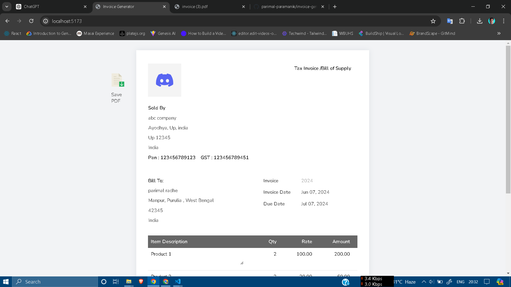
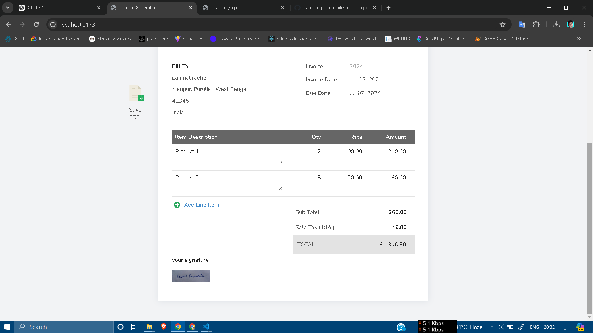

# Invoice Generator


## Overview

**Invoice Generator** is a web application designed to streamline the process of creating professional invoices. Users can easily input details such as seller information, buyer information, product details, and more. The application also allows users to upload their company logo and signature, ensuring a personalized and professional touch. Once the invoice is ready, users can download it as a PDF with a single click.

## Features

- **Seller Information**: Input the details of the company or individual selling the product.
- **Buyer Information**: Input the details of the client or customer purchasing the product.
- **Product Details**: Add, edit, and remove line items, including descriptions, quantities, and rates.
- **Company Logo**: Upload and adjust the width of your company logo.
- **Signature**: Upload your signature to include in the invoice.
- **Download as PDF**: Generate a PDF of the invoice for easy sharing and record-keeping.

## Getting Started

### Prerequisites

- [Node.js](https://nodejs.org/) (version 12 or higher)
- [npm](https://www.npmjs.com/) (version 6 or higher)

### Installation

1. **Clone the repository:**

    ```sh
    git clone https://github.com/your-username/invoice-generator.git
    cd invoice-generator
    ```

2. **Install dependencies:**

    ```sh
    npm install
    ```

3. **Run the application:**

    ```sh
    npm run dev
    ```

4. **Open your browser and navigate to:**

    ```
    http://localhost:3000
    ```

## Usage

1. **Seller Information**: Fill in your company name, address, and country. You can also upload your company logo.
2. **Buyer Information**: Enter your client's name, address, and country.
3. **Product Details**: Add line items by specifying the description, quantity, and rate. The total amount will be calculated automatically.
4. **Signature**: Upload your signature to be included at the bottom of the invoice.
5. **Generate PDF**: Once all details are filled in, click the "Download PDF" button to generate and download your invoice.

## Screenshots

### Home Page


### Invoice Form


### PDF Preview


## License

This project is licensed under the MIT License. See the [LICENSE](LICENSE) file for more details.

## Acknowledgements

## Contact


---


---


